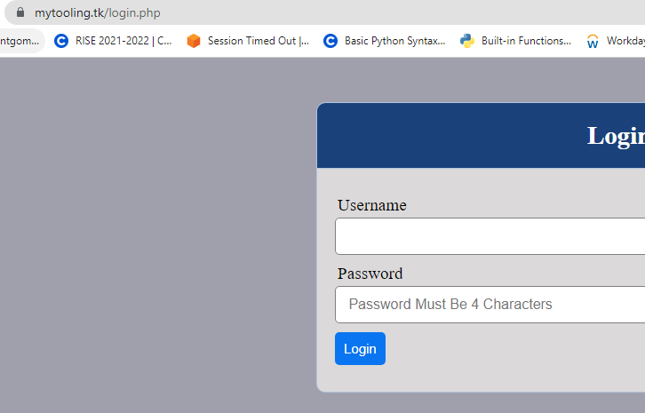

# LOAD BALANCER SOLUTION WITH NGINX AND SSL/TLS
## CONFIGURE NGINX AS A LOAD BALANCER
> Create an EC2 VM based on Ubuntu Server 20.04 LTS and name it Nginx LB
> Update /etc/hosts file for local DNS with Web Servers’ names (e.g. Web1 and Web2) and their local IP addresse
> Install and configure Nginx as a load balancer to point traffic to the resolvable DNS names of the webservers
```
sudo apt update
sudo apt install nginx
sudo vi /etc/nginx/nginx.conf
#insert following configuration into http section

 upstream myproject {
    server Web1 weight=5;
    server Web2 weight=5;
  }

server {
    listen 80;
    server_name www.domain.com;
    location / {
      proxy_pass http://myproject;
    }
  }

#comment out this line
#       include /etc/nginx/sites-enabled/*;
sudo systemctl restart nginx
sudo systemctl status nginx
```
## REGISTER A NEW DOMAIN NAME AND CONFIGURE SECURED CONNECTION USING SSL/TLS CERTIFICATES
> Register a new domain name with any registrar of your choice

>Assign an Elastic IP to your Nginx LB server and associate your domain name with this Elastic IP.
> Update A record in your registrar to point to Nginx LB using Elastic IP address.
>Configure Nginx to recognize your new domain name by updating your nginx.conf with server_name www.<your-domain-name.com> instead of server_name www.domain.com.

> Check that your Web Servers can be reached from your browser using new domain name using HTTP protocol – http://<your-domain-name.com>.
> You should get the following result.


> Install certbot and request for an SSL/TLS certificate
```
sudo systemctl status snapd
sudo snap install --classic certbot
sudo ln -s /snap/bin/certbot /usr/bin/certbot
sudo certbot --nginx
```
> Test secured access to your Web Solution by trying to reach https://<your-domain-name.com>



> Set up periodical renewal of your SSL/TLS certificate
> Configure a cronjob to run the renewal command daily.
```
crontab -e
* */12 * * *   root /usr/bin/certbot renew > /dev/null 2>&1
```
